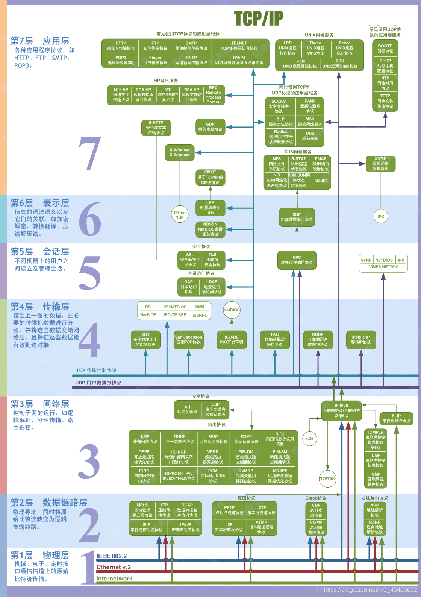
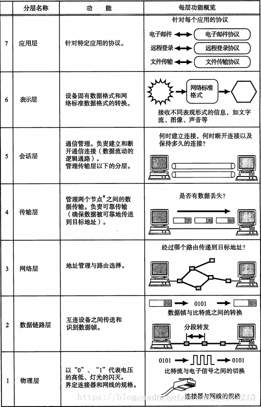
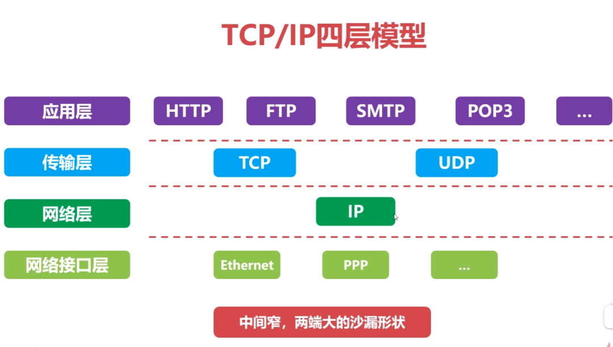
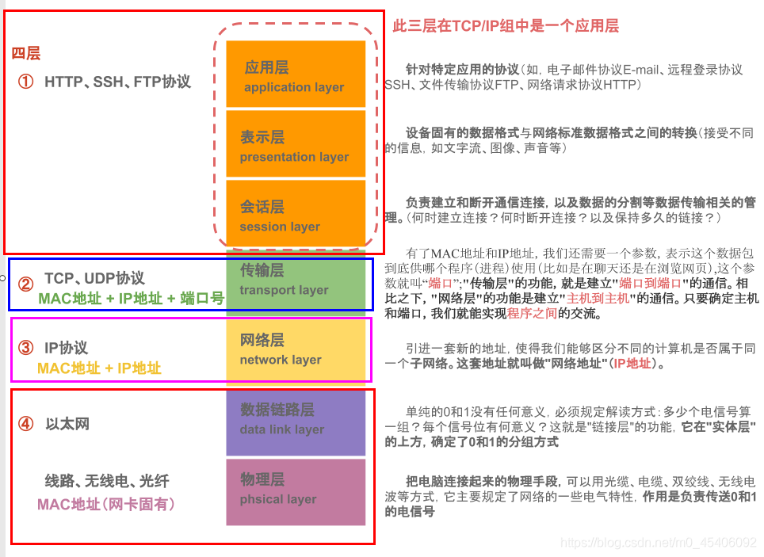
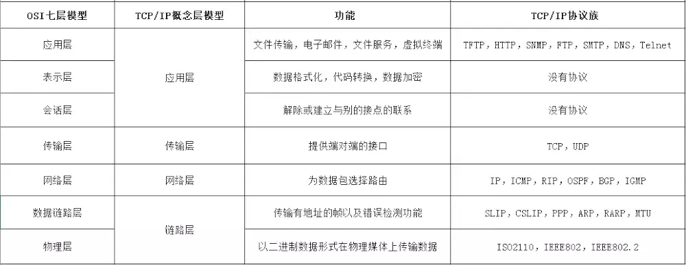
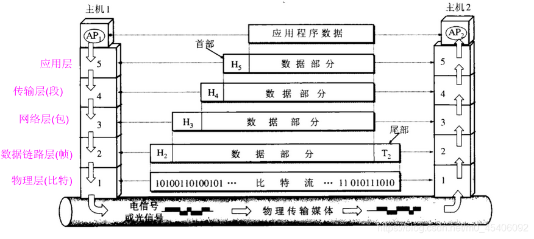

# 计算机网络体系结构
> 相关文章：
> - [【计算机网络】分层、OSI七层协议和TCP四层协议](https://blog.csdn.net/m0_45406092/article/details/118541907)
> - [计算机网络体系结构](https://www.coonote.com/tcpip/computer-network-architecture.html)

## 网络体系结构
在计算机网络的基本概念中，分层次的体系结构是最基本的。分层的主要好处有：
- 1、各层之间是独立的，每一层向上和向下通过层间接口提供服务，无需暴露内部实现
- 2、灵活性好
- 3、结构上可分割
- 4、易于实现和维护
- 5、能促进标准化工作

## OSI七层模型
传统上，我们所知道的是开放系统互连参考模型 (Open System Interconnect 简称OSI）的七层模型。但是事实上，作为法律上的国际标准OSI并没有得到市场的认可。但是我们依旧是有必要了解一下。它的结构以及各层功能如下：

1.`物理层`：主要定义物理设备标准，如网线的接口类型、光纤的接口类型、各种传输介质的传输速率等。它的主要作用是传输比特流（就是由1、0转化为电流强弱来进行传输，到达目的地后再转化为1、0，也就是我们常说的数模转换与模数转换）。这一层的数据叫做比特。

2.`数据链路层`：定义了如何让格式化数据以帧为单位进行传输，以及如何让控制对物理介质的访问。这一层通常还提供错误检测和纠正，以确保数据的可靠传输。如：串口通信中使用到的115200、8、N、1

3.`网络层`：在位于不同地理位置的网络中的两个主机系统之间提供连接和路径选择。Internet的发展使得从世界各站点访问信息的用户数大大增加，而网络层正是管理这种连接的层。在这一层，数据的单位称为数据包(packet)。

4.`传输层`：定义了一些传输数据的协议和端口号（WWW端口80等），如：TCP（传输控制协议，传输效率低，可靠性强，用于传输可靠性要求高，数据量大的数据），UDP（用户数据报协议，与TCP特性恰恰相反，用于传输可靠性要求不高，数据量小的数据，如QQ聊天数据就是通过这种方式传输的）。 主要是将从下层接收的数据进行分段和传输，到达目的地址后再进行重组。常常把这一层数据叫做段。

运输层主要使用一下两种协议

传输控制协议-TCP：提供面向连接的，可靠的数据传输服务。
用户数据协议-UDP：提供无连接的，尽最大努力的数据传输服务（不保证数据传输的可靠性）。

5.`会话层`：通过传输层(端口号：传输端口接收端口)建立数据传输的通路。主要在你的系统之间发起会话或者接受会话请求（设备之间需要互相认识可以是IP也可以是MAC或者是主机名）。

6.`表示层`：可确保一个系统的应用层所发送的信息可以被另一个系统的应用层读取。例如，PC程序与另一台计算机进行通信，其中一台计算机使用扩展二一十进制交换码(EBCDIC)，而另一台则使用美国信息交换标准码（ASCII）来表示相同的字符。如有必要，表示层会通过使用一种通格式来实现多种数据格式之间的转换。

7.`应用层`：是最靠近用户的OSI层。这一层为用户的应用程序（例如电子邮件、文件传输和终端仿真）提供网络服务。数据单位还是报文

一些经常使用的各层协议如下：

应用层：FTP、DNS、Telnet、SMTP、HTTP、WWW、NFS
表示层：JPEG、MPEG、ASII
会话层：NFS、SQL、NETBIOS、RPC
传输层：TCP、UDP、SPX
网络层：IP、ICMP、ARP、RARP、OSPF、IPX、RIP、IGRP、 （路由器）
数据链路：PPP、FR、HDLC、VLAN、MAC （网桥，交换机）
物理层：RJ45、CLOCK、IEEE802.3 （中继器，集线器，网关）

重点是了解集线器、网桥、交换机、路由器即可。

## TCP/IP四层模型

非国际标准的TCP/IP的四层网络体系结构已经成为了主流，成为了事实上的国际标准。

TCP（Transmission Control Protocol，传输控制协议），UDP（User Datagram Protocol，用户数据报协议），IP（Internet Protocol，网络协议）。

- 应用层
- 传输层，TCP和UDP是在该层传输。
- 网络层，也被称为网际层，负责地址管理与路由选择，IP主要在此层作用。
- 网络接口层，它相比OSI，没有了表示层和会话层，把数据链路层和物理层合成为了网络接口层，有的也叫物理链路层。

4层协议和对应的标准7层协议的关系如下图：

分层功能对比：

不同层数据传输：

