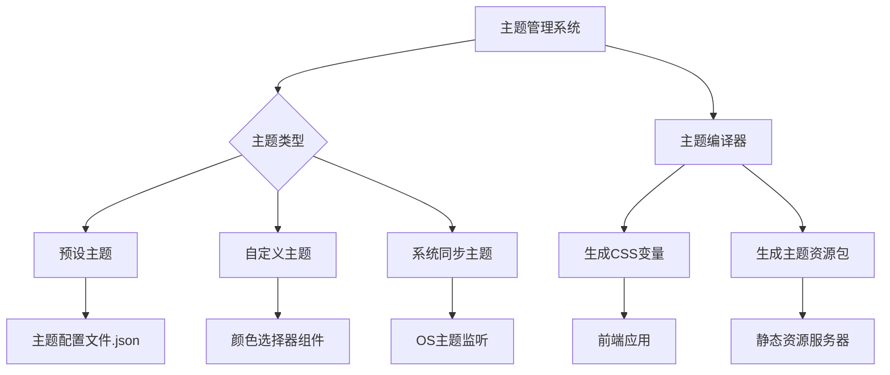

# 如何修改网站主题

以下是修改网站主题的完整解决方案，涵盖从基础样式调整到动态主题切换的实现步骤：

---

### **一、主题修改的三种场景及对应方案**

| 场景分类 | 适用对象 | 技术方案 | 优势 | 缺点 |
|---------|---------|---------|------|------|
| **用户个性化主题** | 普通访客 | 浏览器插件（如Stylus） | 无需开发权限 | 仅本地生效 |
| **网站预设主题** | 网站用户 | CSS变量 + 主题切换控件 | 用户体验统一 | 需开发支持 |
| **系统级主题适配** | 全体用户 | CSS媒体查询（暗黑模式） | 自动适应系统 | 无法自定义 |

---

### **二、开发者实现主题系统（专业方案）**

#### **1. 基础架构设计**
```html
<!-- HTML主题标识 -->
<html data-theme="light">
  <body><!-- 页面内容 --></body>
</html>
```

#### **2. CSS变量定义**
```css
/* 定义全局主题变量 */
:root {
  --primary-color: #2196f3;
  --bg-color: #ffffff;
  --text-color: #333333;
}

/* 暗黑主题变量 */
[data-theme="dark"] {
  --primary-color: #90caf9;
  --bg-color: #121212;
  --text-color: #e0e0e0;
}

/* 使用变量 */
body {
  background-color: var(--bg-color);
  color: var(--text-color);
}
```

#### **3. 主题切换JavaScript逻辑**
```javascript
class ThemeManager {
  constructor() {
    this.themes = ['light', 'dark', 'custom'];
    this.init();
  }

  init() {
    // 读取本地存储或系统偏好
    const savedTheme = localStorage.getItem('theme') || 
      (window.matchMedia('(prefers-color-scheme: dark)').matches ? 'dark' : 'light');
    this.setTheme(savedTheme);
  }

  setTheme(themeName) {
    document.documentElement.setAttribute('data-theme', themeName);
    localStorage.setItem('theme', themeName);
    
    // 派发自定义事件
    document.dispatchEvent(new CustomEvent('themeChange', {
      detail: { theme: themeName }
    }));
  }
}

// 初始化主题管理器
const theme = new ThemeManager();
```

#### **4. 主题切换控件实现**
```html
<!-- 主题选择器 -->
<div class="theme-switcher">
  <button onclick="theme.setTheme('light')">浅色</button>
  <button onclick="theme.setTheme('dark')">深色</button>
  <button onclick="theme.setTheme('custom')">自定义</button>
</div>
```

#### **5. 高级功能扩展**
**动态主题生成：**
```javascript
function createCustomTheme(primaryColor) {
  const style = document.createElement('style');
  style.id = 'custom-theme';
  style.textContent = `
    [data-theme="custom"] {
      --primary-color: ${primaryColor};
      --bg-color: ${calculateContrastColor(primaryColor)};
    }
  `;
  document.head.appendChild(style);
}
```

**主题持久化：**
```javascript
// 监听系统主题变化
window.matchMedia('(prefers-color-scheme: dark)')
  .addEventListener('change', e => {
    if(!localStorage.getItem('theme')) {
      theme.setTheme(e.matches ? 'dark' : 'light');
    }
  });
```

---

### **三、普通用户临时修改方案**

#### **1. 使用浏览器开发者工具**
1. 按 `F12` 打开控制台
2. 进入 `Elements` → `Styles`
3. 实时编辑CSS变量值

#### **2. 浏览器扩展方案**
| 扩展名称 | 功能特点 | 适用浏览器 |
|---------|---------|-----------|
| **Stylus** | 支持编写持久化样式 | Chrome/Firefox |
| **Dark Reader** | 智能暗黑模式转换 | 全平台 |
| **Stylebot** | 可视化样式编辑 | Chrome |

---

### **四、企业级主题系统架构**



---

### **五、性能优化策略**

1. **CSS变量分层管理**
```css
/* 基础变量 */
:root {
  --base-unit: 8px;
  --font-family: system-ui;
}

/* 颜色变量 */
[data-theme] {
  --primary: var(--theme-primary, #2196f3);
  --surface: var(--theme-surface, #ffffff);
}
```

2. **主题切换动画优化**
```css
body {
  transition: 
    background-color 0.3s ease,
    color 0.3s ease;
}
```

3. **按需加载主题包**
```javascript
function loadTheme(themeName) {
  import(`/themes/${themeName}.css`)
    .then(() => console.log('Theme loaded'))
    .catch(err => console.error(err));
}
```

---

### **六、无障碍访问要求**

1. **WCAG对比度标准**
```javascript
function checkContrast(bg, text) {
  const contrast = getContrastRatio(bg, text);
  return contrast >= 4.5; // AA标准
}
```

2. **高对比度主题**
```css
[data-theme="high-contrast"] {
  --bg-color: #000000;
  --text-color: #ffffff;
  --link-underline: 2px solid yellow;
}
```

---

### **七、测试方案**

1. **视觉回归测试**
```bash
# 使用BackstopJS生成主题快照对比
backstop reference --config=backstop_theme_config.js
backstop test --config=backstop_theme_config.js
```

2. **自动化测试脚本**
```javascript
describe('Theme System', () => {
  test('切换主题应更新data属性', () => {
    theme.setTheme('dark');
    expect(document.documentElement.dataset.theme).toBe('dark');
  });
});
```

---

通过以上方案，可以实现从简单到企业级的主题管理系统。开发者可根据项目规模选择合适方案，普通用户也可通过浏览器工具实现个性化需求。关键要点是：CSS变量架构、状态持久化、系统级适配、性能优化和无障碍支持。