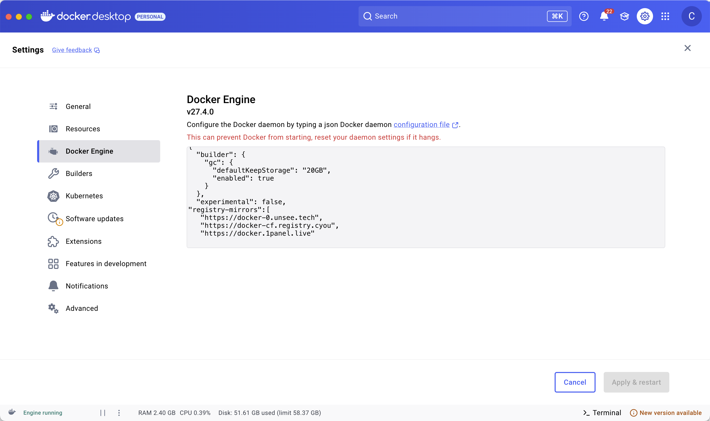

# Docker 镜像源配置

Docker 镜像源即是对 Docker 镜像仓库 dockerhub 的访问地址

## 国内镜像源
国内镜像源更新可以跟踪着几个站点
- [目前国内可用Docker镜像源汇总](https://www.coderjia.cn/archives/dba3f94c-a021-468a-8ac6-e840f85867ea)
- [DockerHub 国内加速镜像列表](https://github.com/dongyubin/DockerHub)

## 镜像源配置

### docker desktop 客户端配置


## 配置文件
配置文件在 `/etc/docker/daemon.json`

```bash
# 创建目录
sudo mkdir -p /etc/docker

# 写入配置文件
sudo tee /etc/docker/daemon.json <<-'EOF'
{

    "registry-mirrors": [

    	"https://docker-0.unsee.tech",

        "https://docker-cf.registry.cyou",

        "https://docker.1panel.live"

    ]

}

EOF
# 重启docker服务
sudo systemctl daemon-reload && sudo systemctl restart docker
```