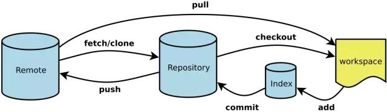

# git 总结
> 官网：https://git-scm.com/

Git 是一个开源的分布式版本控制系统，用于敏捷高效地处理任何或小或大的项目。
Git 是 Linus Torvalds 为了帮助管理 Linux 内核开发而开发的一个开放源码的版本控制软件。

Git 与常用的版本控制工具 SVN, CVS, Subversion 等不同，它采用了分布式版本库的方式，不必服务器端软件支持。


## 核心概念
工作原理 / 流程：


- **工作目录（Working Directory）**：这是你在本地计算机上看到的工作副本。
- **暂存区（Staging Area）**：一个临时存储区域，用于保存即将提交到本地仓库的更改。你可以选择性地将工作目录中的更改添加到暂存区中。
- **本地仓库（Local Repository）**：这是一个隐藏在 `.git` 目录中的数据库，用于存储项目的所有提交历史记录。
- **远程仓库（Remote Repository）**：通常位于服务器上，允许多个用户协作开发同一个项目。可以通过 `git clone` 命令复制远程仓库到本地。

## 基本操作流程

1. **初始化仓库**：使用 `git init` 命令可以在当前文件夹下创建一个新的 Git 仓库。
2. **克隆仓库**：用 `git clone [url]` 复制远程仓库到本地。
3. **添加文件到暂存区**：使用 `git add <file>` 或者 `git add .` 将更改添加到暂存区。
4. **查看状态**：`git status` 可以显示哪些文件被修改但尚未添加到暂存区，以及哪些文件已经准备好提交。
5. **提交更改**：通过 `git commit -m "message"` 将暂存区的内容提交到本地仓库。
6. **同步远程仓库**：`git pull` 从远程仓库拉取最新的更新并与本地分支合并；而 `git push` 则是推送本地提交到远程仓库。

## 分支管理

- 创建新分支可以用 `git branch <branch-name>` 或者直接切换并创建 `git checkout -b <branch-name>`。
- 合并分支时可以选择使用 `git merge` 或者更推荐的方式是 `git rebase`，后者会保持线性的提交历史。
- 删除本地分支可以通过 `git branch -d <branch-name>` 完成，对于远程分支，则需执行 `git push origin --delete <branch-name>`。

## 其他

###  git 配置

#### 配置用户名与邮箱
```bash
git config --global user.name "xxx"
git config --global user.email "xxx"
```

#### 查看全局配置
```bash
git config --list
```

### 日志
```bash
git log
```
**参数**：
- `--oneline`：显示每条提交记录的简略信息，包括提交哈希值、提交者、提交时间等。
- `--stat`：显示每条提交记录的修改文件列表和修改行数。
- `--graph`：显示提交记录的树状结构，方便查看提交记录的依赖关系。
- `--all`：显示所有分支的提交记录，包括本地分支和远程分支。

### 撤销操作
撤销操作
- 撤销本地修改：`git checkout -- <file>`


### 标签管理

### 解决冲突

### 代码合并